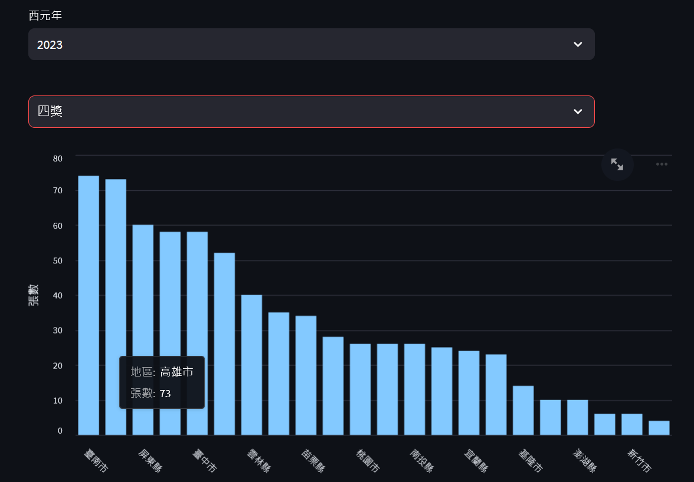

# 說明
### 這個repository主要使用電子發票OpenAPI取得資料儲存至SQL SERVER, 之後使用python及Streamlit套件將API所提供的原始資料進行視覺化。
1. 開發環境說明:
   * Java : Open JDK 17 or Oracle JDK 17 with Maven Project.
   * python : 3.8.10
   * SQL Server : SQL server 2022 Developer (https://learn.microsoft.com/en-us/sql/linux/quickstart-install-connect-ubuntu?view=sql-server-ver16)
   * Database Connection Tool : 建議使用免費的資料連線工具 - DBeaver (https://dbeaver.io/)
2. 畫面展示 :

3. getOpenData目錄: java code 自電子發票OPEN API取得開獎獎別及區域, 取得的資料寫入MSSQL database。Database的目的table可參考CreateTable_MSSQL.sql。
4. dataAnalysis目錄: python code 自資料庫取得資料, 匯出CSV後進行基礎統計及繪圖，可容易看出特定年度特定獎項落點統計。python 版本使用3.8.10, 所需件請參考requirements.txt
5. 完成python環境及requirements.txt套件安裝, 重現步驟3畫面使用以下指令:
`streamlit run invoiceStreamlit.py`
